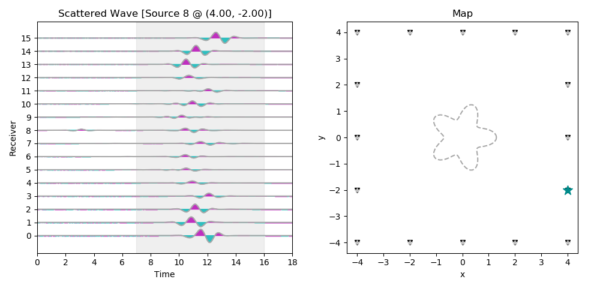
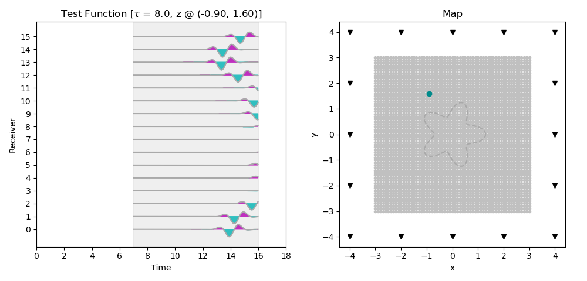
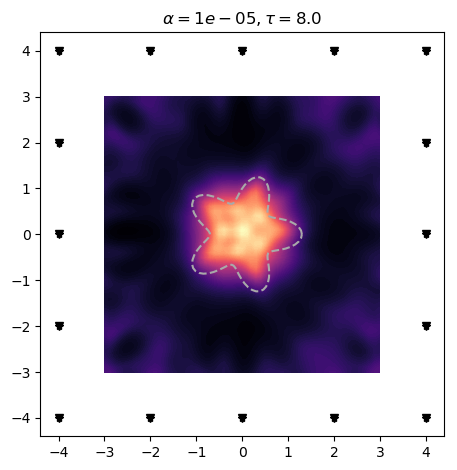
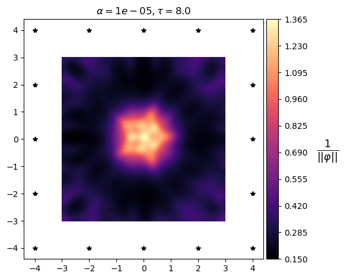
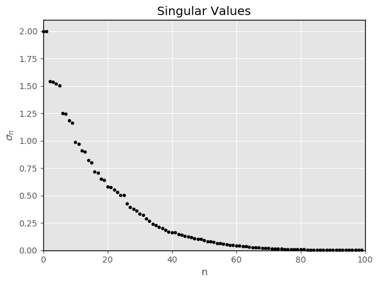
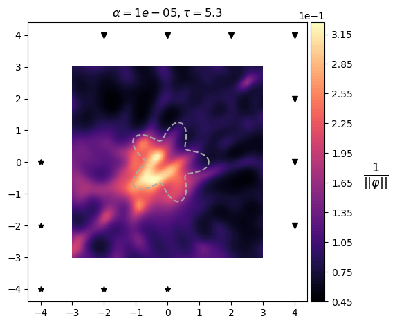

# Vezda
Vezda, simplified from the Russian звезда (zvezda) meaning *star*, is an open-source software package written in the Python programming language for imaging objects found in the interiors of various media. In many areas of application, such as medical imaging, geophysical exploration, or noninvasive testing, one wants to locate an object or feature which is embedded within a host material and inaccessible to direct observation. By interrogating the enclosing material with a wave, one can noninvasively obtain measurements of the hidden object by recording the waves that scatter off it. Vezda implements a modern technique from inverse scattering theory called the *linear sampling method* to estimate the shape and location of the hidden object.

## Getting Started
Before you can begin using Vezda, you need to make sure you have the required software prerequisites as well as the data prerequisites pertaining to your imaging experiment.

### Data Prerequisites
Vezda relies on the following sources of input data:
* Source locations
* Receiver locations
* Recording times
* Measured scattered wave data
* Simulated test functions<sup>1</sup>
* Object/scatterer boundary (optional)

See the user manual located under the **vezda/docs/** directory for more information on the required data format. 

<sup>1</sup> For imaging objects within inhomogeneous (variable) host materials, you will need to supply the simulated test functions. For imaging objects within homogeneous (constant) host materials, Vezda can simulate the test functions for you, so long as you provide a **pulseFun.py** file. See the user manual for more information.

### Software Prerequisites
Vezda requires Python 3. If you only have Python <= 2.7 on your system, you will need to obtain a Python 3 installation to run the Vezda software. Fortunately, there are several options freely available to you which make satisfying this prerequisite simple. I personally recommend using the [Anaconda](https://www.continuum.io/downloads) distribution if you do not already have a Python 3 installation set up. It is perhaps the easiest and quickest way to get a working Python installation up and running with all the scientific and numeric libraries included. As Python is cross-platform, you can download an installation for Windows, macOS, and Linux.

### Installing Vezda
Installing Vezda is simple. It is contained entirely in a binary Python wheel found in the Python Packaging Index [PyPI](https://pypi.python.org/pypi/vezda/).

#### Option 1: Install from Python wheel
Python wheels provide a faster and more efficient method to install software packages than traditional installs from source files. Additionally, they provide more consistent installations across operating systems and machines.

To install Vezda from the Python wheel, simply enter:
```
$ pip install vezda
```
By default, pip will install the Vezda software package under the **site-packages/** directory on your ```$PYTHONPATH```. To locate the root folder containing the Vezda source files, simply enter the Vezda ```vzhome``` command:
```
$ vzhome
/path/to/your/python/site-packages/vezda
```

#### Option 2: Install from source files
Alternatively, you can download the entire Vezda source distribution. Simply clone this Github repository. Move to the desired location on your system where you would like to place the **vezda/** source directory and enter:
```
$ git clone https://github.com/aaronprunty/vezda
$ cd vezda/
$ python setup.py install
```

### Uninstalling Vezda
Should you ever wish to uninstall Vezda from your system, simply enter
```
$ pip uninstall vezda
```
This works regardless of which option above you chose to install Vezda. If you installed Vezda from the source distribution ('Option 2') and you wish to remove all files and directories that came with the Vezda distribution, move to the location on your system where you cloned the **vezda/** repository and enter:
```
$ rm -rf vezda/
```

### Tutorial & Examples

Included in the Vezda software package are fully working examples applied to various imaging problems. Each example contained in the **vezda/examples/** directory contains a **data/** folder, a **README.md** file with step-by-step instructions, and a **figures/** folder with figures to the imaging problem. 

The **vezda/examples/starfish-tutorial/** folder provides an introductory tutorial for using the Vezda software package to reconstruct a starfish-shaped scatterer. If you are new to using Vezda, start with the starfish tutorial and then move on to other examples, which in general will be less explanatory and more cookbook or recipe oriented.

## A simple and flexible interface
Vezda is designed from the ground up to make data visualization and imaging with the linear sampling method as simple and as elegant as possible. This is achieved by minimizing the complexity of the user interface and maximizing the flexibility and customization of the software to different imaging applications.

#### Intuitive Plotting:
Easily navigate through your data volumes using the &leftarrow;, &uparrow;, &rightarrow;, &downarrow;  arrow keys along with maps to visualize both your measured scattered wave data:

<p align="center">
  
</p>
 
and simulated test functions:

<p align="center">
  
</p>

Customize images to show the information what you want:
```
$ vzimage --show_scatterer=no --show_receivers=no --colorbar=yes
```
<p align="center">
   
</p>

#### Explore different imaging scenarios:

Easily take a given data set and visualize how the image would change by altering the acquisition setup:

<p align="center">
   
</p>

## Contributing

Please read [CONTRIBUTING.md](https://github.com/aaronprunty/vezda/blob/master/CONTRIBUTING.md) for details on the adopted code of conduct, and the process for submitting pull requests.

## Author

* **Aaron C. Prunty**

See also the list of [contributors](https://github.com/aaronprunty/starfish/contributors) who participated in this project.

## License

This project is licensed under the Apache License, Version 2.0 - see the [LICENSE](LICENSE) file for details.

## Acknowledgements

* Special thanks to Yukun Guo for providing the original MATLAB source files and the starfish example.
