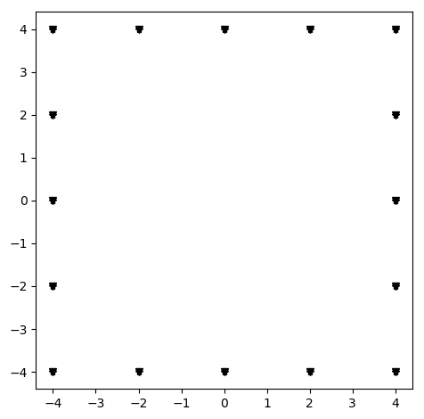
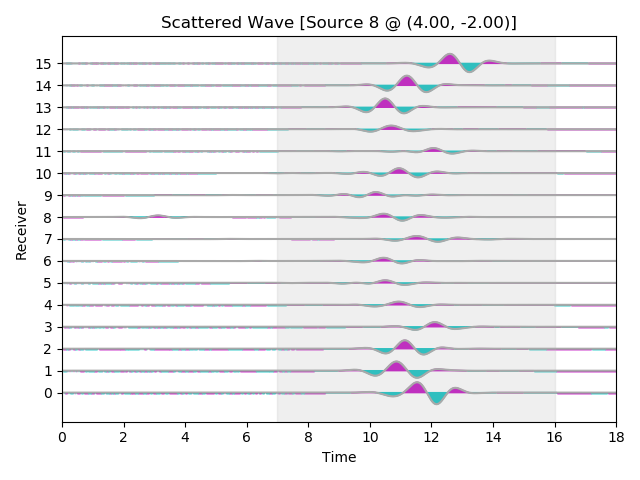
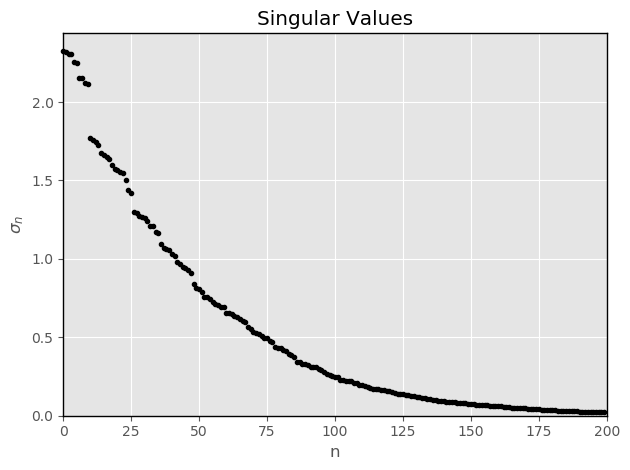

# Instructions
The **vezda/examples/starfish-tutorial/** directory contains two examples: *starfish1* and *starfish2*. Each example is intended to show you how you can use the Vezda software package to explore your data and different imaging scenarios.

The starfish experiment uses data obtained from a full-aperature, source-receiver acquisition setup to reconstruct a starfish-shaped scatterer. In the *starfish1* example, we'll use the full-aperature data to reconstruct the starfish. In the *starfish2* example, we'll explore how to determine the effects of limited-aperature data acquisition and illumination using the Vezda software package. 

The first step in using the Vezda software package is to set up a **data/** directory containing the measured data, the source and receiver locations, recording times, and (if available) the boundary of the scatterer. This step is already taken care of for you, since we already have a **data/** folder for the starfish experiment. 

For the starfish experiment, the data happens to reside in a Matlab structured array contained in a '.mat' file. A short Python script **extractData.py** is provided that allows Matlab users to extract the experimental data and save them in NumPy '.npy' format. From the **vezda/examples/starfish-tutorial/** folder, change into the **data/** subfolder:
```
$ cd data/
$ ls
extractData.py	starfish.mat
```
The **starfish.mat** file contains all the data we need for the starfish imaging experiment. You can extract the data as follows:
```
$ python extractData.py
$ ls
extractData.py		recordingTimes.npy	scattererPoints.npy	starfish.mat
receiverPoints.npy	scatteredData.npy	sourcePoints.npy
```
In the starfish experiment, the sources and receivers happen to be co-located. Hence, if you view the contents of **extractData.py**, you will notice that the source points are simply set to be the same as the receiver points. You can use this file and adapt it to your needs accordingly. For more information on the data requirements and formats for the Vezda software package, refer to the user manual found under **vezda/docs/**.

We now have all our data in a format ready to be used by the Vezda software. The next step is to create a separate working directory where we will perform the imaging (this is not strictly required, but it is good practice keep the inputs and outputs of your workflow separate). Again, this step is already done – we called our working directory 'starfish1'. Thus, we will be running all of the Vezda codes in the 'starfish1' folder from here on.

Next, move into the **starfish1/** folder (where this 'README.md' file and a few other things already exist). Since we are working in a different directory, we need to tell the Vezda software where to find the input data. This is achieved using the Vezda ```vzdata``` command and setting its argument ```--path``` as follows:
```
$ vzdata --path=../data/

              Expected file 'testFunctions.npy' not found. Does a file exist
              containing the simulated test functions? (This is NOT a required file.)
              Enter 'y/yes' to specify the filename containing the simulated test
              functions (must be binary NumPy '.npy' format).
              Enter 'n/no' to proceed without specifying the test functions. (Default)
              Enter 'q/quit' to exit this program.
              
Action:
```
After specifying the path to our **data/** directory, the ```vzdata``` command scans the directory for certain files. In particular, it looks for NumPy '.npy' files that follow a naming convention. Required files include '.npy' files for sources coordinates, receiver coordinates, recording times, and scattered wave data. Optional '.npy' files include simulated test functions and scatterer points. In this example, all of the data files in our **data/** directory follow the assumed naming convention. In your own imaging problems, it does not matter what you name your data files, so long as you have a file for each required input listed above. In the starfish experiment, we do not have a '.npy' file for the simulated test functions. Vezda detects this and prompts the user for input. Instead, since the starfish scatterer is embedded within a constant background medium, we will use the Vezda software to compute the free-space test functions by supplying a **pulseFun.py** file (the file MUST have this name!) We will simply respond to the prompt with 'no' and proceed without specifying a test functions file: 
```
$ vzdata --path=../data/

              Expected file 'testFunctions.npy' not found. Does a file exist
              containing the simulated test functions? (This is NOT a required file.)
              Enter 'y/yes' to specify the filename containing the simulated test
              functions (must be binary NumPy '.npy' format).
              Enter 'n/no' to proceed without specifying the test functions. (Default)
              Enter 'q/quit' to exit this program.
              
Action: no
Proceeding without specifying the simulated Green functions.
$ ls
README.md	datadir.npz	images		pulseFun.py
```

The ```vzdata``` command creates a **datadir.npz** file in the current working directory which simply lets the Vezda software know where to find the input data. The other items already in the **starfish1/** folder are the **pulseFun.py** file used by Vezda to compute the free-space test functions, and a **figures/** folder that contains some figures you should obtain from following these instructions. To begin visualizing the data, let's view the experimental setup. Simply run the Vezda ```vzimage``` command:
```
$ vzimage
```

<p align="center">
  
</p>

You should see a square array of points where stars or asterisks denote source positions and inverted triangles denote receiver positions. Run ```vzimage``` with its ```-h``` or ```--help``` flag to see a complete list of its command-line arguments. For example, you may want to invert one of the axes:
```
$ vzimage --invert_xaxis=yes
```

<p align="center">
  
</p>

If you happen to know the true scatterer and have the coordinates of its boundary (which we have in our **data/** directory as the **scattererPoints.npy** file), you may view the scatterer with:
```
$ vzimage --show_scatterer=yes
```

<p align="center">
  
</p>

You may apply multiple command-line arguments at once:
```
$ vzimage --show_receivers=no --xlabel=x --ylabel=y
```

<p align="center">
  
</p>

Each time you specify a new plotting parameter when running ```vzimage```, Vezda saves it in the **plotParams.pkl** file so you don't need to specify it again. Thus, if you run ```vzimage``` with no other arguments, the figure will show up with all of your saved plotting parameters. For this tutorial, we'll undo the x-axis inversion:
```
$ vzimage --invert_xaxis=no
```

<p align="center">
  
</p>

Next, let's visualize the scattered wave data. This is achieved using the Vezda ```vzwiggles``` command and specifying its ```--type``` argument. There are two types of 'wiggles' we are interested viewing: the first are our measured data ```--type=data```, and the second are computed/simulated Green functions ```--type=Gfunc```. To view our scattered wave data, enter:
```
$ vzwiggles --type=data
```

<p align="center">
  
</p>

You should see a wiggle plot with the receivers on the vertical axis and time on the horizontal axis. Note that specifying ```--type=data``` set the plot title accordingly. The particular source that produced the current data is also shown in the plot title. You can easily navigate through the data volume using the &leftarrow;, &uparrow;, &rightarrow;, &downarrow;  arrow keys to view the data produced from different sources. Again, you can run ```vzwiggles``` with the ```-h``` or ```--help``` flag to see a complete list of its command-line options.

A particularly useful feature of the ```vzwiggles``` command is to run it with its ```--map``` option:
```
$ vzwiggles --type=data --map=yes
```

<p align="center">
  
</p>

After viewing our data volume, we notice most of the wiggles arrive between 7 and 16 units along the time axis; otherwise, the wiggle traces are zero. Part of the imaging method implemented in the Vezda software requires a singular value decomposition (SVD) on the data volume. To reduce compuational cost, let's apply a time window around this interval. This is achieved using the Vezda ```vzwindow``` command as follows:
```
$ vzwindow --time=7,16,2
window @ receivers : start =  0
window @ receivers : stop =  16
window @ receivers : step =  1
window @ time : start =  7.0
window @ time : stop =  16.0
window @ time : step =  2
window @ sources : start =  0
window @ sources : stop =  16
window @ sources : step =  1
```
The first two numbers passed to the ```--time``` argument, 7 and 16, specify the start and end of our window. The third value, 2, tells the Vezda software to use every second value (i.e., every other value) in the windowed time interval. This is essentially another cost saving, and it won't deteriorate the quality of our final image if our time signal is well sampled. You will notice additional output from the ```vzwindow``` command pertaining to the sources and receivers. This is because the Vezda ```vzwindow``` command acts on the three axes of our data volume: receivers, time, and sources. Run ```vzwindow -h``` for a detailed description of its command-line options.

Now that we've set a time window, run the ```vzwiggles``` command again and you'll notice that the time window is automatically shown in the plots:
```
$ vzwiggles --type=data
```

<p align="center">
  
</p>

Next, we need to compute a singular-value decomposition. In this example, we'll compute the first 200 largest algebraic singular values and vectors. This step is by far the most computationally intensive part of the shape reconstruction process (it takes about 1.5 minutes on a MacBook Pro with a 2.8 GHz Intel Quad-Core i7 processor and 16 GB of memory). The singular-value decomposition is achieved by calling the Vezda ```vzsvd``` command and specifying its ```--numVals``` argument as follows:
```
$ vzsvd --numVals=200
Detected user-specified window...
window @ receivers : start =  0
window @ receivers : stop =  16
window @ receivers : step =  1
window @ time : start =  7.0
window @ time : stop =  16.0
window @ time : step =  2
window @ sources : start =  0
window @ sources : stop =  16
window @ sources : step =  1
Applying window to data...
Computing SVD for 200 singular values/vectors...
Elapsed time: 90.27875399589539 seconds
```
When the computation of the singular-value decomposition has finished, you may view the estimated singular values using the the ```--plot``` argument:
```
$ vzsvd --plot
```

<p align="center">
  
</p>

To reconstruct the shape and location of the starfish scatterer, we need to set up a sampling grid. Having noted the location of the scatterer from our initial ```vzimage``` command, we'll set the sampling grid to span from -3 to 3 along both the x-axis and y-axis with 61 sampling points in each direction. This is achieved using the Vezda ```vzgrid``` command as follows:
```
$ vzgrid --xaxis=-3,3,61 --yaxis=-3,3,61
Setting up two-dimensional sampling grid...
grid @ x-axis : start =  -3.0
grid @ x-axis : stop =  3.0
grid @ x-axis : num =  61
grid @ y-axis : start =  -3.0
grid @ y-axis : stop =  3.0
grid @ y-axis : num =  61
```
We now need to solve a system of equations over our sampling grid. This is acheived using the Vezda ```vzsolve``` command and specifying its ```--regPar``` and ```--timeShift``` arguments as follows:
```
$ vzsolve --regPar=1e-5 --timeShift=8
Sampling: 100%|███████████████████████████████████████████████████████████████| 61/61 [00:12<00:00,  4.78it/s]
```
These particular values of ```--regPar``` and ```--timeShift``` will yield a good reconstruction of the starfish-shaped scatterer. In practice, you will need to run this command several times and play around with different values. You should see a progress bar in your terminal window that gives the percentage of the sampling grid covered (the required 'pulseFun.py' file mentioned earlier is used by the ```vzsolve``` command).

At each sampling point in our grid, the ```vzsolve``` command computed a free-space test function. Run the ```vzwiggles``` command again with ```--type=testFunc``` to visualize them:
```
$ vzwiggles --type=testFunc --map=yes
```

<p align="center">
  
</p>

Finally, to visualize our final reconstruction, simply re-enter:
```
$ vzimage
```

<p align="center">
  
</p>

You should see the same experimental setup as before, but now the sampling grid is shown with a filled contour giving the location of the starfish. If you have followed these instructions exactly, you should obtain the same figures as found in the **figures/** subdirectory. This concludes our first example. To continue exploring the Vezda software package, see the *starfish2* example.
