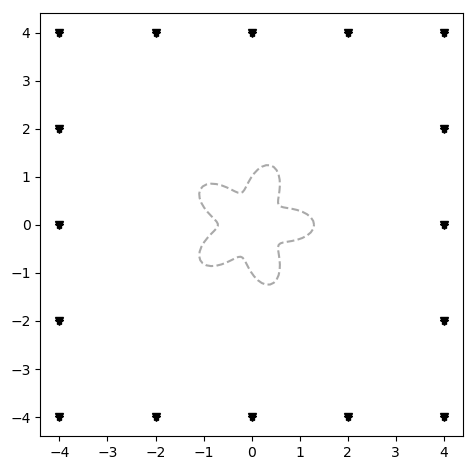
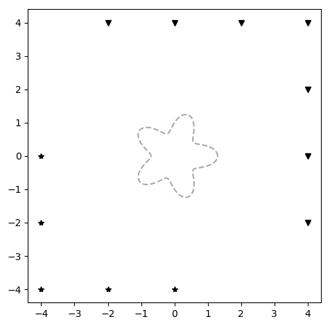
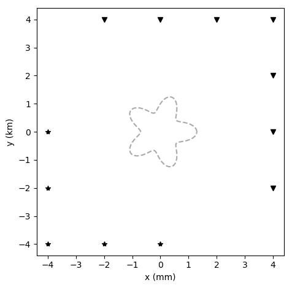
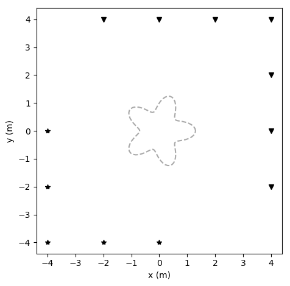
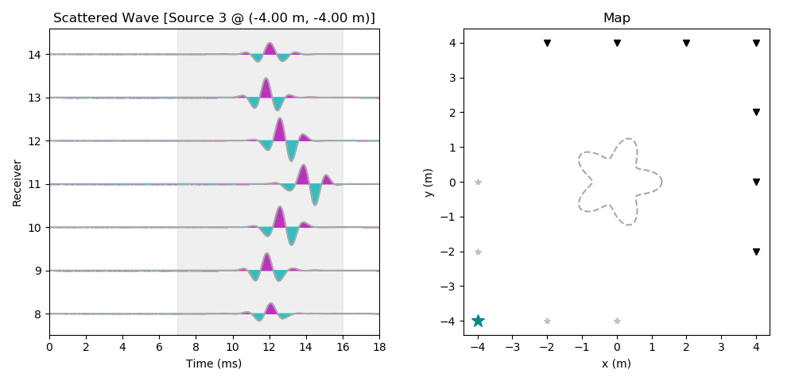
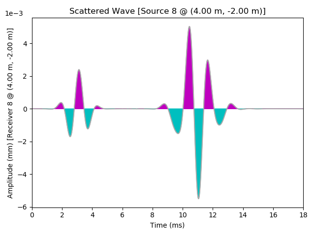
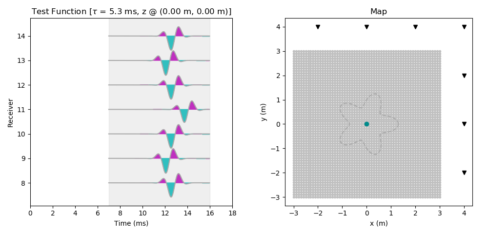

# Instructions
The **vezda/examples/starfish-tutorial/** directory contains two examples: *starfish1* and *starfish2*. Each example is intended to show you how you can use the Vezda software package to explore your data and different imaging scenarios.

The starfish experiment uses data obtained from a full-aperature, source-receiver acquisition setup to reconstruct a starfish-shaped scatterer. In the *starfish1* example, we used the full-aperature data to reconstruct the starfish. In the *starfish2* example, we'll explore how to determine the effects of limited-aperature data acquisition and illumination using the Vezda software package.

This example is a continuation of the *starfish1* example and further explores how to use the Vezda software package. If you are viewing the *starfish2* example first, go back and see the 'README.md' file in the **starfish1/** directory to see how to set up an imaging workflow for the Vezda software. As before, we already have a **data/** folder for the starfish experiment. For this example, we need to create a separate working directory where we will perform the imaging. Again, this step is already done – we called our working directory 'starfish2'. Thus, we will be running all of the Vezda codes in the **starfish2/** folder from here on.

Next, move into the **starfish2/** folder. Since we are working in a different directory, we need to tell the Vezda software where to find the input data. This is achieved using the Vezda ```vzdata``` command and setting its argument ```--path``` as follows:
```
$ vzdata --path=../data/

              Expected file 'testFunctions.npy' not found. Does a file exist
              containing the simulated test functions? (This is NOT a required file.)
              Enter 'y/yes' to specify the filename containing the simulated test
              functions (must be binary NumPy '.npy' format).
              Enter 'n/no' to proceed without specifying the test functions. (Default)
              Enter 'q/quit' to exit this program.
              
Action:
```
As explained in the *starfish1* example, we do not have a **testFunctions.npy** file. Instead, we'll let Vezda compute free-space test functions by providing the necessary **pulseFun.py** file. We respond to the above prompt with a 'no':
```
$ vzdata --path=../data/

              Expected file 'testFunctions.npy' not found. Does a file exist
              containing the simulated test functions? (This is NOT a required file.)
              Enter 'y/yes' to specify the filename containing the simulated test
              functions (must be binary NumPy '.npy' format).
              Enter 'n/no' to proceed without specifying the test functions. (Default)
              Enter 'q/quit' to exit this program.
              
Action: no
Proceeding without specifying the simulated test functions.
```

To begin visualizing the data, let's view the experimental setup along with the starfish-shaped scatterer. Simply run the Vezda ```vzimage``` command as follows:
```
$ vzimage --show_scatterer=yes
```

<p align="center">
  
</p>

You should see a square array of points surrounding an outline of the starfish-shaped scatterer. Again, stars or asterisks denote source positions while inverted triangles denote receiver positions. Run ```vzimage``` with its ```-h``` or ```--help``` flag to see a complete list of its command-line arguments.

In the *starfish2* example, we will apply a window to the receivers, sources, and recording times used for imaging. In particular, we will apply the same time window as in the *starfish1* example, but now we will only use 5 sources located in the bottom left corner of the square array to illuminate the starfish-shaped scatterer and 7 receivers in the top right corner of the square array to record the scattered waves. This is achieved using the Vezda ```vzwindow``` command as follows:
```
$ vzwindow --time=7,16,2 --sources=1,6,1 --receivers=8,15,1
window @ receivers : start =  8
window @ receivers : stop =  15
window @ receivers : step =  1
window @ time : start =  7.0
window @ time : stop =  16.0
window @ time : step =  2
window @ sources : start =  1
window @ sources : stop =  6
window @ sources : step =  1
```
The first two numbers passed to the ```--time```, ```--sources```, and ```--receivers``` arguments specify the start and end of our windows. The third value passed to each argument tells the Vezda software how to sample the windowed interval. Recall that the Vezda ```vzwindow``` command acts on the three axes of our data volume: receivers, time, and sources.

By default, the step size for each axis of the data volume is set to one. To allow more flexibility in windowing our data volume, the Vezda software allows users to simply specify either a single windowing parameter or all three for each axis. This is achieved specifying the ```--start```, ```--stop```, and ```--step``` arguments preceeded by either a ```t``` for the time axis, an ```r``` for the receiver axis, or an ```s``` for the source axis. For example, we could have applied the same window above as:
```
$ vzwindow --tstart=7 --tstop=16 --tstep=2 --sstart=1 --sstop=6 --rstart=8 --rstop=15
window @ receivers : start =  8
window @ receivers : stop =  15
window @ receivers : step =  1
window @ time : start =  7.0
window @ time : stop =  16.0
window @ time : step =  2
window @ sources : start =  1
window @ sources : stop =  6
window @ sources : step =  1
```
or
```
$ vzwindow --time=7,16,2 --sstart=1 --sstop=6 --rstart=8 --rstop=15
window @ receivers : start =  8
window @ receivers : stop =  15
window @ receivers : step =  1
window @ time : start =  7.0
window @ time : stop =  16.0
window @ time : step =  2
window @ sources : start =  1
window @ sources : stop =  6
window @ sources : step =  1
```
You may use whichever notation you find more convenient. Run ```vzwindow -h``` for a detailed description of its command-line options.

Let's visualize the experimental setup again:
```
$ vzimage
```

<p align="center">
  
</p>

This time you should see 5 sources located at the bottom left corner of the square array and 7 receivers located at the top right corner of the square array.

Suppose we want to set up a figure for publication. To make our image more professional, we can add labels and units to the axes using the ```--xlabel/--ylabel``` and ```--xu/yu``` arguments, respectively. We can additionally specify the format of the saved image:
```
$ vzimage --xlabel=x --xu=m --ylabel=y --format=svg
```

<p align="center">
  
</p>

Note that we did not specify a unit for the y-axis. By default, Vezda will assign the same units to the y-axis as those specified for the x-axis if ```--yu``` is not specified. Of course, we can always specify different units for the axes:
```
$ vzimage --xu=mm --yu=km
```

<p align="center">
  
</p>

For this tutorial, we will simply set the x- and y-units to be the same:
```
$vzimage --xu=m
```

<p align="center">
  
</p>

Now, let's visualize the scattered wave data. Similar to the ```vzimage``` command for setting x- and y-axis units, we can specify time and amplitude units using the ```vzwiggles``` command:
```
$ vzwiggles --type=data --map=yes --tu=ms --au=mm
```

<p align="center">
  
</p>

You should see a wiggle plot with the receivers on the vertical axis and time on the horizontal axis. Additionally, you see that the window has been applied to the source, receiver, and time axes. Again, you can navigate through the data volume using the &leftarrow;, &uparrow;, &rightarrow;, &downarrow;  arrow keys to view the data produced from different sources. Run the ```vzwiggles``` command with its ```-h``` or ```--help``` flag to see a complete list of its command-line arguments.

When several receivers are displayed along the y-axis of the wiggle plots, Vezda does not display amplitude information. To see that the amplitude units have been set, we can apply a temporary window to the receiver axis:
```
$ vzwindow --receivers=8,9,1
window @ receivers : start =  8
window @ receivers : stop =  9
window @ receivers : step =  1
window @ time : start =  0.0
window @ time : stop =  18.0
window @ time : step =  1
window @ sources : start =  0
window @ sources : stop =  16
window @ sources : step =  1
```
and plot
```
$ vzwiggles --type=data
```

<p align="center">
  
</p>

To continue with this tutorial, we will reapply our original window and move on:
```
$ vzwindow --time=7,16,2 --sources=1,6,1 --receivers=8,15,1
window @ receivers : start =  8
window @ receivers : stop =  15
window @ receivers : step =  1
window @ time : start =  7.0
window @ time : stop =  16.0
window @ time : step =  2
window @ sources : start =  1
window @ sources : stop =  6
window @ sources : step =  1
```

Next, we need to compute a singular value decomposition. In this example, we'll compute the first 100 largest algebraic singular values and vectors. This step is by far the most computationally intensive part of the shape reconstruction process (it takes about 17 seconds on a MacBook Pro with a 2.8 GHz Intel Quad-Core i7 processor and 16 GB of memory). The singular value decomposition is achieved by calling the Vezda ```vzsvd``` command and specifying its ```--numVals``` argument as follows:
```
$ vzsvd --numVals=100
Detected user-specified window...
window @ receivers : start =  8
window @ receivers : stop =  15
window @ receivers : step =  1
window @ time : start =  7.0
window @ time : stop =  16.0
window @ time : step =  2
window @ sources : start =  1
window @ sources : stop =  6
window @ sources : step =  1
Applying window to data...
Computing SVD for 100 singular values/vectors...
Elapsed time: 17.434329986572266 seconds
```
When the computation of the singular value decomposition has finished, you may view the estimated singular values using the ```--plot``` argument:
```
$ vzsvd --plot
```

<p align="center">
  
</p>

To reconstruct the shape and location of the starfish scatterer, we set up the same sampling grid as in the *starfish1* example. This is achieved using the Vezda ```vzgrid``` command as follows:
```
$ vzgrid --xaxis=-3,3,61 --yaxis=-3,3,61
Setting up two-dimensional sampling grid...
grid @ x-axis : start =  -3.0
grid @ x-axis : stop =  3.0
grid @ x-axis : num =  61
grid @ y-axis : start =  -3.0
grid @ y-axis : stop =  3.0
grid @ y-axis : num =  61
```
We now need to solve a system of equations over our sampling grid. This is acheived using the Vezda ```vzsolve``` command and specifying its ```--regPar``` and ```--timeShift``` arguments as follows:
```
$ vzsolve --regPar=1e-5 --timeShift=5.3
Sampling: 100%|███████████████████████████████████████████████████████████████| 61/61 [00:06<00:00,  8.92it/s]
```
These particular values of ```--regPar``` and ```--timeShift``` will yield a reasonably good reconstruction of the starfish-shaped scatterer given our limited-aperature acquisition setup. In practice, you will need to run this command several times and play around with different values. You should see a progress bar in your terminal window that gives the percentage of the sampling grid covered (the required 'pulseFun.py' file mentioned earlier is used by the ```vzsolve``` command).

As in the *starfish1* tutorial, the ```vzsolve``` command simulated a free-space test function at each point in our sampling grid. Run the ```vzwiggles``` command with ```--type=testFunc``` to view them:
```
$ vzwiggles --type=testFunc --map=yes
```

<p align="center">
  
</p>

Finally, to visualize our final reconstruction, we simply enter ```vzimage```. This time, however, let's add a colorbar:
```
$ vzimage --colorbar=yes
```

<p align="center">
  
</p>

You should see the same experimental setup as before, but now the sampling grid is shown with a filled contour giving the approximate location of the starfish. Notice we were only able to locate the lower left leg of the starfish with our given limited-aperature setup. If you have followed these instructions exactly, you should obtain the same figures as found in the **figures/** subdirectory. Feel free to continue playing around with these starfish examples to become more comfortable with Vezda and experiment with different imaging scenarios. Other imaging experiments and examples will be added to the Vezda distribution over time.
